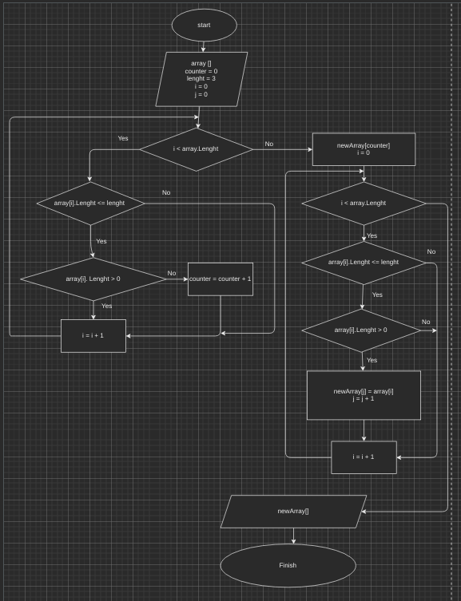

# Итоговая проверочная работа.

## Задание: Написать программу, которая из имеющегося массива строк формирует массив из строк, длинна которых меньше или равна 3 символа. 

## Для решения данной задачи потребуется:

1. Узнать количество элементов соответствующих условию задачи в массиве.
2. Создать новый массив для найденного количества элементов.
3. Скопировать элементы, соответствующие условию в новый массив.

Не обязательным условием задачи является получение/вывод массива. 

Задачу целесообразно разбить на две подзадачи (выполнить декомпозицию):
1. Подсчет количества элементов соответствующих условию.
2. Создать новый массив и скопировать соответствующие элементы.

1 подзадачу целесообразно сделать универсальной и вычислять любое количество символов в строке.
Строка это набор символов, следовательно любая строка имеет длинну(количество символов), которая может быть высчитана. Пустые или нулевые строки имеют длину равную 0 и не содержат символов, следовательно должны быть исключены.
Алгоритм решения представлен ниже:





Для переноса блок- схемы на язык C# были использованв два метода:
1. `int GetArrayLenght(string?[] array, int lenght)` - считает количество элементов массива, соответствующих условию.
2. `string?[] GetNewArray(string?[] array, int counter, int lenght)` возвращает массив, состоящтй из соответствующих элементов.

Два следующих метода являются вспомогательными.
 Метод `void PrintStringArray(string?[] array)` выводит в консоль все элементы массива **string** а метод`string?[] EnterArrayFromKeyboard()` позволяет ввести массив строк из консли пользователем.

Следующий код:
```
string?[] array = EnterArrayFromKeyboard();
int lenght = 3;
int counter = GetArrayLenght(array, lenght);
PrintStringArray(array);
PrintStringArray(GetNewArray(array, counter, lenght));

```
запрашивает у пользователя массив строк, вычисляет количество элементов с количеством символов 3 и выводит в консоль первоначально заданный пользователем массив и массив, состоящий из элементов с количеством символов 3 и меньше.


      